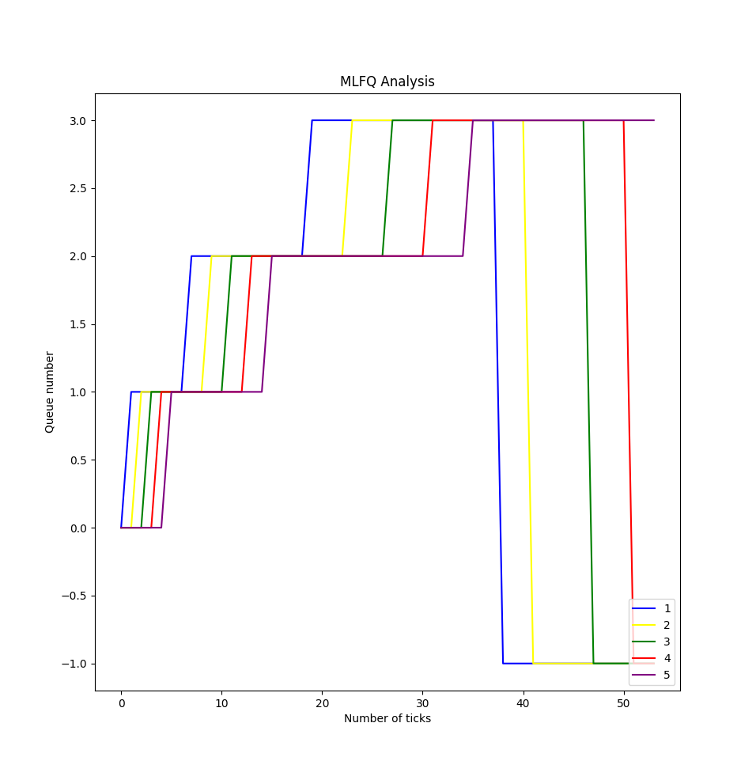

# xv6-riscv

## Specification 1: System Calls

### `trace`

Traces a process's system calls, specified by the bit mask.
Strace user program runs the given command and traces it.

### `sigalarm`

Calls specified function on regular intervals.

### `sigreturn`

Restores the process state right after sigalarm handler exits.

***

## Specification 2: Scheduling

### FCFS

1. Added field `ctime` to `proc.h > struct proc {}` to keep track of the creation time of the process. Initialise `ctime` with the global variable `ticks` in `proc.c > allocproc()`

2. Loop through the process list in `proc.c > scheduler()` and find the runnable process with the lowest `ctime` and context switch to it.

3. Make it so that the process does not give up the CPU when a timer interrupt occurs. This is done to ensure that the currently running process is not preempted. To do this, disable `yeild()` in `trap.c > usertrap()` and `trap.c > kerneltrap()`.

### LBS

1. Added field `tickets` to `proc.h > struct proc {}` to keep track of the number of tickets owned by a process. Initialise `tickets` to 1 in `proc.c > allocproc()`.

2. Loop through the process list in `proc.c > scheduler()` to find the list of runnable processes (`runnable_procs[]`) and the sum of tickets (total_tickets) of all these processes.

3. While looping in `2`, acquire the lock for all the runnable processes as it is unknown which process will get selected.

4. Randomly select a ticket from `[1, total_tickets]` and select the process corresponding to that ticket. Release the lock for all other processes and schedule the selected process.

5. Do not disable `yeild()` in `trap.c > usertrap()` and `trap.c > kerneltrap()`, as we recquire preemption.

### PBS

The non preemptive PBS scheduler sets static priority of each process and uses their "niceness" to schedule processes with minimum dynamic priority.

1. Set `s_priority` of each process as 60, `niceness` as 0 by default.
2. In the scheduler, use the given formula to calculate `niceness` and then get dynamic priority of the process.
3. Schedule the processes with numerically least (highest priority) dynamic priority.
4. The processes can set their own priority using the system call `set_priority`.

### MLFQ

1. Added the following fields to `proc.h > struct proc {}`

- `inqueue` : Is the process in a queue? then 1 else 0

- `q_num` : Which queue is the process in?

- `total_rtime` : "time spent running - ticks that a process has run for

- `wtime` : "time spent waiting in queue"

2. Implement a function `handle_spes()` which handles aging, dequeueing of sleeping processes and preemption.
3. Call the `handle_specs` function in usertrap upon timer interrupts and in the beginning of the scheduler funciton `MLFQ_scheduler`.
4. schedule the first process in the highest priority queue.

***

## Specification 3: Copy-on-write fork

Upon fork, the child's pagetable is mapped to the parent's pages. The PTEs pointing to these pages are marked as non writable and `COW` by clearing `PTE_W` and setting `PTE_COW` (defined as 8th bit of PTE).

In usertrap, check if the fault code is `15` and faulted address is a `COW` address. If so, allocate a new page to the PTE and map it to the process' PTE.

Edit copyout which is called when a child exits, to act the same as COW handler in usertrap.

## Performance Comparison

|            | RR | FCFS | LBS | PBS | MLFQ |
|     --     | -- |  --  |  -  |  -  |  -  |
| Avg. rtime |  4  |  7   |   9  |  6   |  6  |
| Avg. wtime |  28  |   28   |  28   |  30   |  34  |

## Plot of MLFQ analysis

-1 refers to process having ended.

